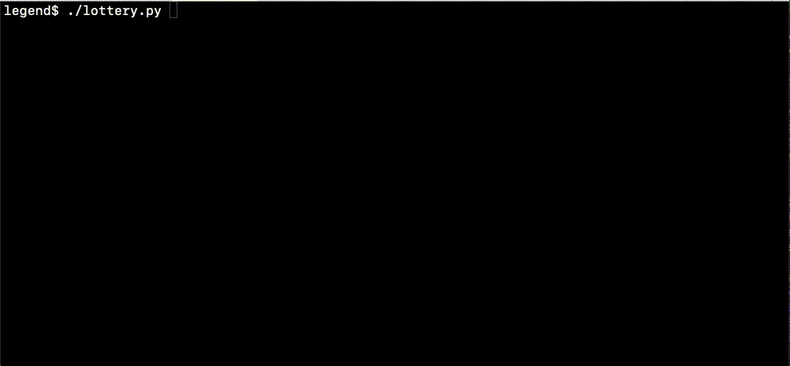

# NFTLegends BlockHash-based lottery

## About

The script picks pseudo-random Ethereum winner account from the list using native blockchain randomness source - the blockhash on the given block height.

It uses the “Mersenne Twister” deterministic 623-dimensionally equidistributed uniform pseudorandom number generator, one of the most extensively tested randomizers in existence.


Accounts collected through the form were checked to comply ethereum account format (42-digit hex string starting with '0x').
Duplicates were removed and items sorted alphabetically. See [refine_eth_accounts.py](refine_eth_accounts.py) script for details.

## Rounds

### Round 0

* Block: **[12362727](https://etherscan.io/block/countdown/12362727)** on Ethereum Mainnet #1
* Estimated Target Date: **Mon May 03 2021 17:58:29 GMT**
* Refined accounts list: **[accounts.txt](accounts.txt)**
* Participants total: **13208**
* Round log [round_000.log](round_000.log)
* Winner: `0x58aaEf291ccE6D326D43952b3b7173aEadAab37e`



### Round 1

* Block: **[12408686](https://etherscan.io/block/countdown/12408686)**
* Estimated Target Date: **Mon May 10 2021 19:55 GMT**
* Refined accounts list: **[accounts.txt](accounts.txt)**
* Participants total: **13560**
* Round log [round_001.log](round_001.log)
* Winner: `0x68360a6306cA82B769898034c83c41c09ab0e689`

## How to verify

Just run the [lottery.py](lottery.py) after the target block got mined + 3 confirmations passed.

```sh
pip install -r requirements.txt
python3 lottery.py
```

The output:

```sh
Load accounts from accounts.txt... DONE
Sanity checks... DONE
Total accounts loaded: 13208
Connect to Web3 Ethereum provider... DONE
Target block: 12362727 
Confirmations: 3 

Target block 12362727 mined!
Hash of the block 12362727 is 0x7c34217a7b9bd20910375b9d36dcfb6fa082bab59a4fb8d7bcb6f469e3a7b4d9
See it on Etherscan https://etherscan.io/block/12362727
Target block 12362731 confirmed!

The winner is: 0x58aaEf291ccE6D326D43952b3b7173aEadAab37e
```
